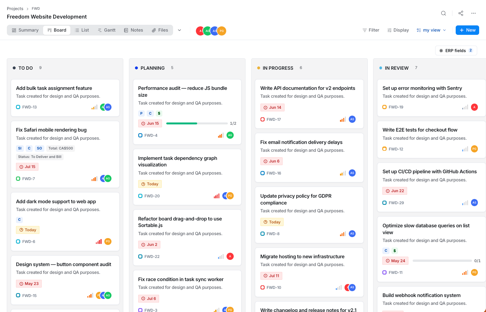

<p align="center">
  
</p>

<h1 align="center">BatchProjects</h1>

<p align="center"><b>Enterprise-grade project management, built natively into ERPNext.</b></p>

<p align="center">
  <a href="LICENSE"></a>
  <a href="https://github.com/BatchNepal/batch_projects/stargazers"></a>
  <a href="CONTRIBUTING.md"></a>
  <a href="https://frappeframework.com"></a>
</p>

<p align="center">
  
</p>

BatchProjects brings a complete delivery-management system — boards, backlogs,
sprints, timesheets, dashboards, and reporting — directly into
[ERPNext](https://erpnext.com), running on the [Frappe](https://frappeframework.com)
framework. Tasks are first-class ERPNext citizens: linked to Sales Orders,
Purchase Orders, Timesheets, and Accounting Dimensions, so delivery status and
financials live in one system instead of two that don't talk to each other.

Built for operational and services organizations first — consulting,
agencies, construction, manufacturing — with sprints and story points
available as an optional mode rather than a forced default.

## Features

- **Boards, backlog, sprints, and Gantt** — the full delivery-tracking
  surface, with drag-and-drop, realtime updates, and saved views.
- **ERP-native by design** — tasks link to Sales Orders, Purchase Orders,
  Timesheets, Expense Claims, and Accounting Dimensions, so project delivery
  and project financials share one source of truth.
- **Timesheets and cost reporting** — log time against tasks and roll it up
  into margin and utilization reports without exporting to a spreadsheet.
- **Custom fields, per-project workflows, and role-based access** — model
  each team's process without forking the schema.
- **Automation rules** — a visual rule builder for status transitions,
  notifications, and cross-project workflows.
- **Fully open source** — backend and frontend, no feature gate on the free
  tier's core functionality.

## Who this is for

Three ways people run this, all supported:

| You are... | BatchProjects | Optional premium add-on |
|---|---|---|
| **Self-hosting, with Docker** (e.g. [`frappe_docker`](https://github.com/frappe/frappe_docker)) | `bench get-app` into your existing bench | Same VPS or a separate one — see [`deploy/`](deploy/) |
| **Self-hosting, bare bench** (no Docker) | `bench get-app`, same as any Frappe app | Same VPS (as a systemd service) or a separate one |
| **On Frappe Cloud** | Install from your bench as usual | A separate VPS (Frappe Cloud doesn't host arbitrary services) — see [`deploy/`](deploy/) |

## Quick start

```bash
bench get-app https://github.com/BatchNepal/batch_projects --branch version-15
bench --site yoursite.local install-app batch_projects
```

That's the entire free-tier install — no Node, no build step, no external
service. The `version-15` branch tracks ERPNext v15; see
[`deploy/README.md`](deploy/README.md) for the full version-compatibility
story and how branch naming maps to ERPNext versions going forward.

For local frontend development, see [`CONTRIBUTING.md`](CONTRIBUTING.md).

## Built with

[Frappe Framework](https://frappeframework.com) · [ERPNext](https://erpnext.com) · [Vue 3](https://vuejs.org) · [Pinia](https://pinia.vuejs.org) · Python

## The optional gateway add-on

Realtime updates, automation rules, push notifications, and a few other
premium features run through a small companion service (**bp-gateway**) that
sits alongside ERPNext rather than inside it. It's closed-source (that's how
the project sustains development) but fully documented and self-hostable —
you run it on your own infrastructure via a signed Docker image, and no data
goes anywhere but your own servers. If you only need the free tier, skip this
entirely — BatchProjects runs standalone.

See [`deploy/README.md`](deploy/README.md) for the install guide.

## License

BatchProjects — the Frappe app and the Vue frontend, everything in this
repo — is licensed under the **GNU Affero General Public License v3.0**
(AGPL-3.0-only). See [`LICENSE`](LICENSE).

The practical implication of AGPL: if you modify this app and run it as a
network service for others (e.g. offer it as SaaS), you must make your
modified source available to those users. Just self-hosting it for your own
company, unmodified or modified, carries no such obligation beyond attribution.

The optional `bp-gateway` add-on is separate, proprietary software,
distributed as a signed container image under its own license — using it is
optional and doesn't change the license of BatchProjects itself.

## Contributing

PRs welcome — see [`CONTRIBUTING.md`](CONTRIBUTING.md) for the branch model,
dev setup, and CI requirements. Security issues: see
[`SECURITY.md`](SECURITY.md), please don't file those as public issues.

## Changelog

See [`CHANGELOG.md`](CHANGELOG.md).
